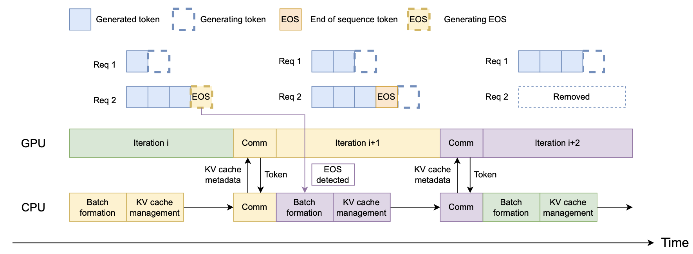

它是一个希望提高吞吐的 LLM 高性能推理框架。主要特性有三点：

1. 设备内部并发
2. 异步 CPU 调度
3. SSD offloading

NanoFlow 背后的 insight 是传统的 pipeline 设计因为操作执行是顺序的，所以没法充分利用物理资源。因此设计了设备内并发（下图 gif），使用 nano-batch 来并发调度算力、内存、通信相关的操作。这种重叠执行，让 compute bound 成为关键路径，增加了资源利用率。

上图是展示设备内部的并行，即 GEMV、O的计算等可以流水起来
而图里的 UGD2 是什么呢？

GPU 利用率很高之后，CPU 上的开销，包括 kv-cache 管理、batch 信息、retired requests selection 等，占比就大了(>10%)。因此 NanoFlow 使用异步的控制流(这样就 cpu 和 GPU overlap 起来），如下图。在任意 iteration i，NanoFlow 作出 batch 选择，在本 iteration 结束之前，就分配下一个 iter 里需要的 kv-cache 项（可以在内存里，然后搬运到 gpu）。直接发射 iteration i+1，而不需要检测到 end-of-sequence （EOS）token，在 iteration i+2 时把完成的 requests 释放掉。

上图里的 GEMV 操作，是矩阵-向量乘法，是计算 Q、K、V 时，当 batch size 为1，那就是输入向量和矩阵的乘法。但是当 bs > 1 ，就是矩阵乘法(GEMM)

图里，GPU 上依然是串行？而 cpu 上是提前一个 iteration 在做决策。

为了避免重计算和重复使用多轮对话里的 KV-Cache，NF 主动 offloads 结束了的 request 的 KV-Cache 项到 SSDs。在一个 iteration 里，NF 已经选择退休了的 requests 并发他们在 GPU 推理操作之时就并发拷贝到 host 上，通过一层层的方式。我们的计算展示了 serving LLaMA2-70B 时只需要 5GB/s 的 offloading 带宽，而单个 SSD 可以达到 3GB/s 的带宽。

TODO: 看下论文
