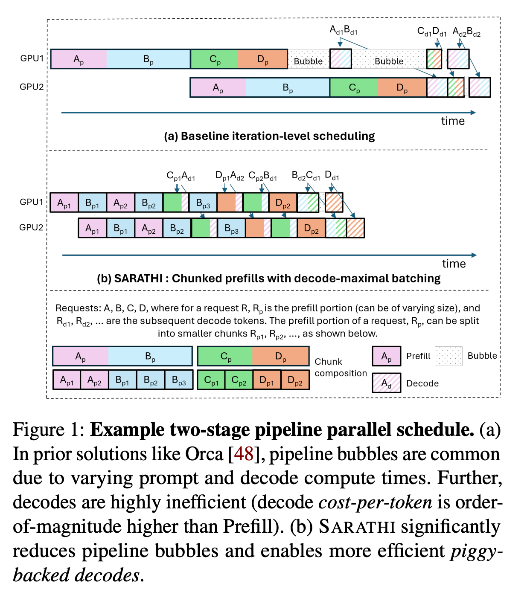

prefill 由于 prompt 有长的，所以即使 batchsize 比较小，也能把 GPU 利用率提高(比如 A6000 GPU，LLaMA 13B，512 tokens 上的 prefill），而 decode 阶段计算利用率很低，因为每次就一个 token。prefill 和 decode 耗时不同，导致在 pipeline 的情况下，microbatch 之间会有气泡。

SARATHI 使用 chunked-prefill，把 prefill 请求分解为大小相等的 chunks，然后使用 decode-maximal batching，它使用一个 prefill chunk 和剩余位置都用 decode 来填充的 batch 方式。这样推理时， prefill chunk 会榨干 GPU 算力，而 decode 请求 是呗顺带算出来，此时代价比单独一个 batch 上计算 decode 要小很多。chunked-prefills 可以让单个 prefill 请求，就可以构造出来多个 decode-maximal 的 batches，最大化可以 piggyback 的 decodes。而且，这种 batch 下的统一的计算设计，减轻了 pp 下 micro-batches 上的不均衡，显著减小了 pipeline 里的气泡。

图一：two-stage pipeline 并行调度的例子。(a) Orca 之类的方案里，pipeline bubbles 很常见，因为 prompt 和 decode 计算时间各不相同。而且 decode 是非常不高效的(cost-per-token 是比 prefill 高一个维度的）
(b) SARATHI 显著减少了 pipeline bubbles，而且 piggy-backed decodes 更加高效

图里能看出来，prefill 显著比 decode 耗时长，毕竟长度上来说，前者是n，后者是1

主要贡献：
1. Chunked-prefills 让 work-units 的构建是计算密集，而且一致(uniform)的（固定执行时长？）
2. Decode-maximal batch 让低效的 decode 可以在高效的 prefills 时顺带完成（这个 piggyback 语义有点牵强
3. 这两个技术，让 pp 显著降低 bubbles

### 2.3 多 GPU 下 LLM 推理

TP：让 model weights 和 KV cache 都均分。
PP：model weights 也是均分，那 kv cache 呢？

